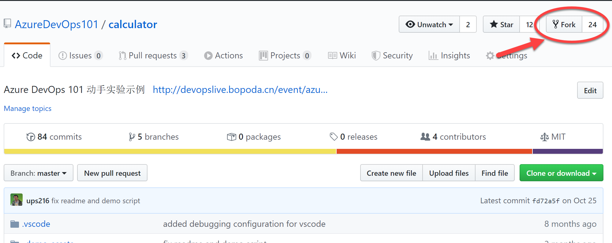
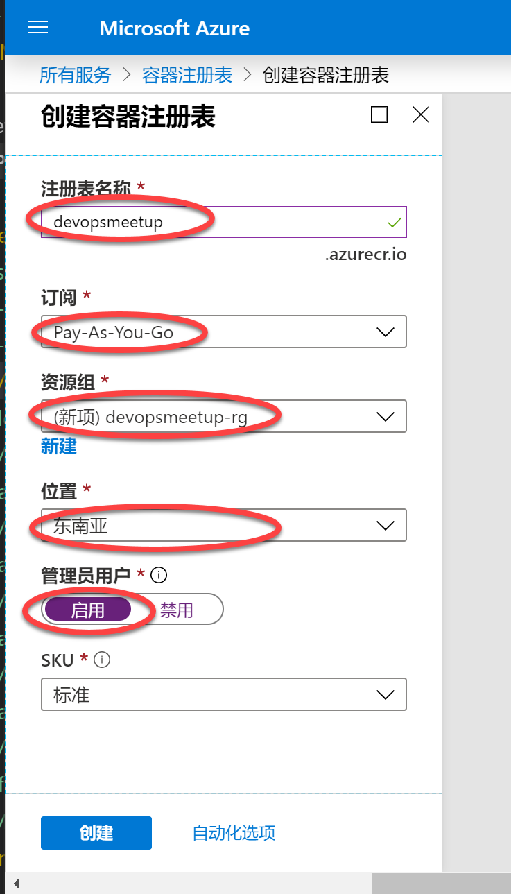

# 练习 1 - 准备环境

在这里练习中，我们将完成代码库的fork操作，并启动Azure Kubernetes Services (AKS)和 Azure Container Registry (ACR)的部署。因为AKS的部署需要较长时间，因此我们将这个步骤提前，以便保证大家在后续的实验中可以直接使用已经创建好的AKS服务。

## 任务 1 - 获取实验代码库地址并fork到自己的github账号

本实验所使用的代码都通过以下Git Repo提供

<https://github.com/AzureDevOps101/calculator>

点击右侧 Fork 按钮将代码 Fork 到你自己的个人GitHub账号之下

## 任务 2 - 创建Azure Container Registry容器注册表作为容器镜像仓库

因为我们的部署过程会使用Docker容器的方式将应用部署到AKS中，因此我们需要一个容器镜像仓库用于存放我们的Docker容器。按照以下操作创建你自己的容器镜像仓库。

1. 进入Azure Portal并找到Azure Container Registry服务

打开 <https://portal.azure.com/> 点击左上角的菜单按钮，并选择 **所有服务**，定位到**容器注册表**服务

2. 创建容器注册表服务

在 **容器注册表** 服务页面上点击 **添加** 按钮，并填写以下表单：

- 注册表名称：自己决定
- 订阅：选择你自己的Azure订阅
- 资源组：建议新建一个（最后在后续的实验步骤中都使用这一个资源组，便于后续清理资源）
- 位置：建议选择 **东南亚**
- 管理员用户：启用

配置完成后，点击 **创建** ，并等待操作完成。

## 任务 3 - 创建Azure Kubernetes Services (AKS) 托管的k8s服务集群

我们将使用AKS作为我们应用运行的生产环境，因为AKS集群创建时间较长，我们在这里先行操作，便于后续直接使用。

**重要**：以下操作将创建一个3节点的AKS集权，将会产生比较大的费用，请注意在实验结束后及时删除。

1. 进入Azure Portal并找到Azure Container Registry服务

打开 <https://portal.azure.com/> 点击左上角的菜单按钮，并选择 **所有服务**，定位到**Kubernetes服务**服务

2. 创建 Kubernetes 服务

在 Kubernetes服务 页面上点击 **添加** 按钮

修改或填写以下参数

- 订阅：先择你自己的可用订阅
- 资源组：选择上面ACR所使用的同一个资源组
- Kubernetes集群名称；自行决定
- 区域：（亚太）东南亚

检查参数正确并点击 **查看 + 创建**

在验证页面中确认参数正确

点击 **创建**

**注意**: 此过程需要大概10分钟时间，你可以进入后续的实验了。
