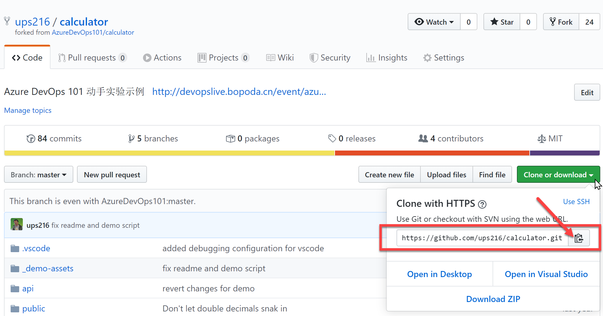
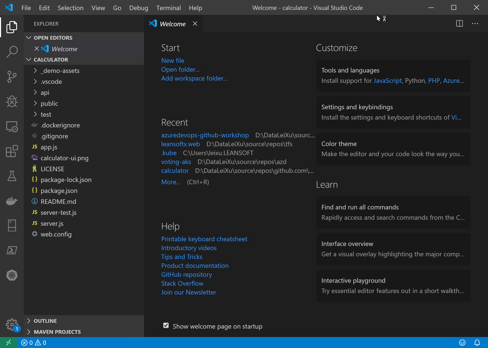
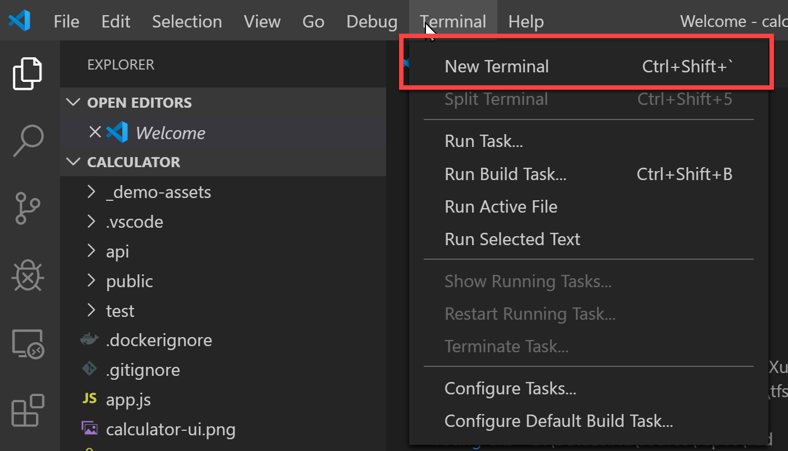
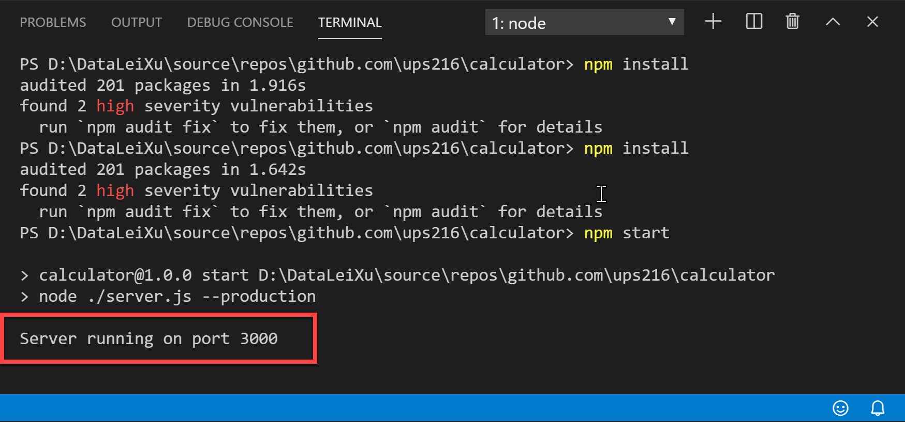
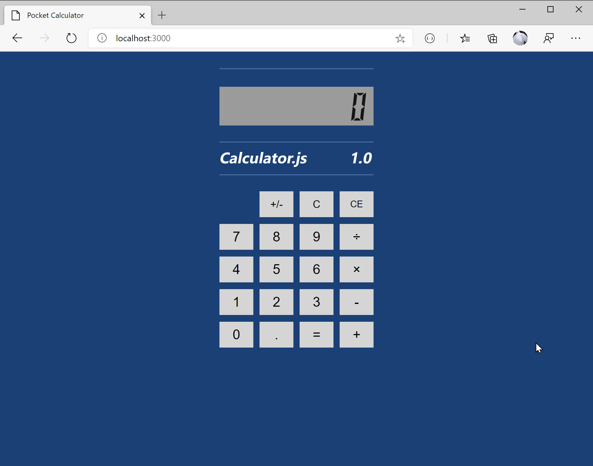

# 练习 2 - 本地调试代码（可选）

在本实验式样中，你将把实验项目的代码clone到本地并在本地运行应用。

**注意**： 完成以下操作需要按照实验首页要求安装本地调试工具。

## 任务 1 - 克隆代码到本地

进入你在 **练习 1** 中所fork出来的git repo，并点击右上角的clone按钮获取git repo url，并复制此url。



在本地打开命令行窗口，并执行以下命令

```shell
git clone <你的gir repo url>
```

等待clone完成，并进入项目代码仓库，使用vscode打开代码

```shell
cd calculator
code .
```



## 任务 2 - 构建项目代码并运行

在vscode中打开内置的terminal命令行窗口，在菜单中选择 **Terminal | New Terminal**



在新建的 Terminal 窗口中运行 npm 命令

``` shell
npm install
npm start
```

检查npm服务器启动并处于以下状态



打开浏览器，并打开 <http://localhost:3000>



确保你的计算器正常。
