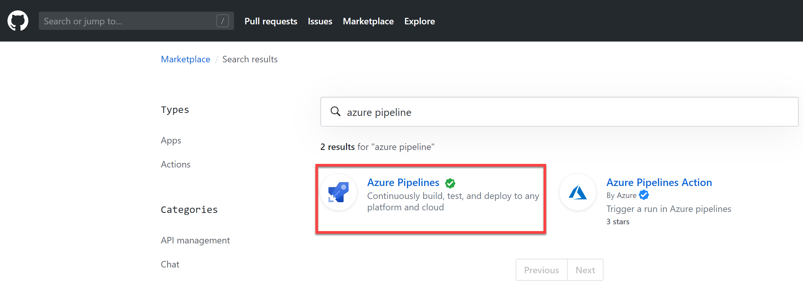

# 练习 3 - 搭建Azure Pipeline流水线持续集成部分并触发CI

这个实验中，我们将创建Azure Pipeline的持续集成配置。

## 任务 1 - 在Github中激活Azure Pipeline插件

在自己所fork得github repo中点击 **Marketplace** 菜单

在 **Marketplace** 中搜索并定位到 azure pipeline 插件

点击 **Azure Pipeline** 插件

点击 **Setup a New Plan** 按钮

在 **Pricing and Setup** 中，点击 **INstall for free**

**注意：** Azure Pipeline对于Github上得公开git仓开是完全免费的，并提供10条并发跨平台流水线。

在 **Review your Order** 页面中，点击 **Complete order and begin installation** 按钮

在 **Azure Pipeline** 插件详细信息页面上，点击 **Save** 

## 任务 2 - 创建Azure Pipeline并运行持续集成CI操作

以上操作会引导你进入Azure DevOps环境，并显示以下引导界面，请选择创建新的项目，并给项目一个名称。请将此项目也设置为 Public （公开项目）。

点击 **Continue** 按钮后等待Azure DevOps完成项目创建操作

在 **Select your Repo** 页面中选择你的GitHub Repo名称

Azure DevOps将自动检测你的GitHub Repo中的代码，并发现你使用了Node Js，推荐你使用以下配置。请选择 Node.js 模板

Azure DevOps根据你的代码结构自动创建了流水线配置文件 azure-pipeline.yml。你可以直接点击 **Save and Run** 启动流水线运行。

在弹出的对话框中，保留所有默认配置，点击 **Save and Run** 按钮启动流水线运行。

等待以上CI运行完成。

## 任务 3 - 检查代码库

回到你自己的Github Repo中，你会发现Azure Pipeline在你的代码库中添加了一个叫做azure-pipeline.yml的文件，此文件内容即为刚才运行的流水线的全部动作的配置文件。这里我们所使用的是Pipeline as Code的方式创建流水线，这种方式允许开发人员通过修改配置文件(azure-pipeline.yml)的方式直接控制流水线的动作，将流水线的配置活动与编码活动统一，可以大幅提升流水线的可维护性。

## 任务 4 - 更新流水线配置，添加自动化测试

在GitHub中到 _demo-assets/azure-pipeline.yml 文件，并将此文件内容替换到以上步骤中Azure Pipeline自动创建的文件内容上。

此操作将再次触发Azure Pipeline持续集成的运行，回到Azure Pipeline中，你将看到如下构建正在运行的状态。

在新版的azure-pipeline.yml文件中，我们主要添加了自动化测试和制品打包的动作。等待以上构建完成，查看运行结果如下。

点击 **Summary** 页面并展开测试部门的日志，你将看到嵌入在Azure Pipeline流水线中的自动化测试结果。

点击右上角 **Artifact** 按钮你将看到已经打成zip包的发布制品。

至此，我们就完成了Azure Pipeline自动化构建持续集成CI的搭建和运行。