# 练习 4 - 搭建Azure Pipeline流水线持续部署部分并触发CD

本实验中，我们将完成代码发布到Azure云环境的操作。

## 任务 1 - 创建 应用程序服务 作为本应用的测试环境

进入Azure Portal并找到 **应用程序服务**

打开 <https://portal.azure.com/> 点击左上角的菜单按钮，并选择 **所有服务**，定位到**应用程序服务**

**注意**：应用程序服务提供全托管的应用运行环境，你无需操心关心虚拟机而只需要部署自己的应用程序即可。Azure会完成操作系统和虚拟机的统一管理，比如补丁和安全性更新，系统扩缩容等。

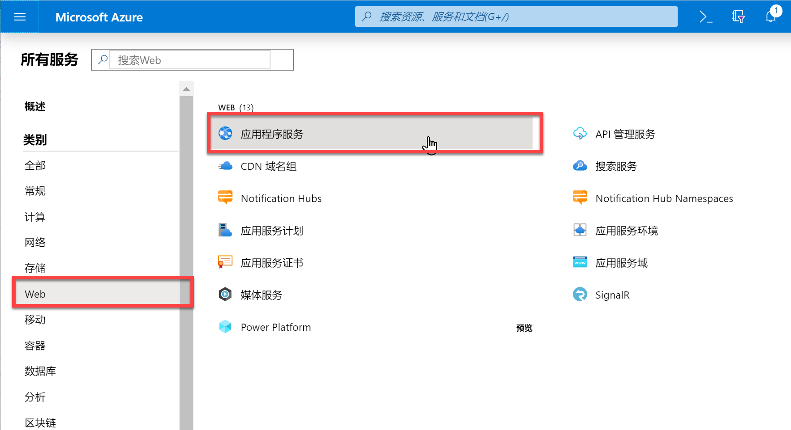

在 **应用程序服务** 页面上点击 **添加** 按钮并填写以下参数

- 订阅：选择你的可用订阅
- 资源组：选择本实验中所用的统一资源组
- 名称：自行选择
- 运行时堆栈：Node 8.10
- 区域：Southeast Asia

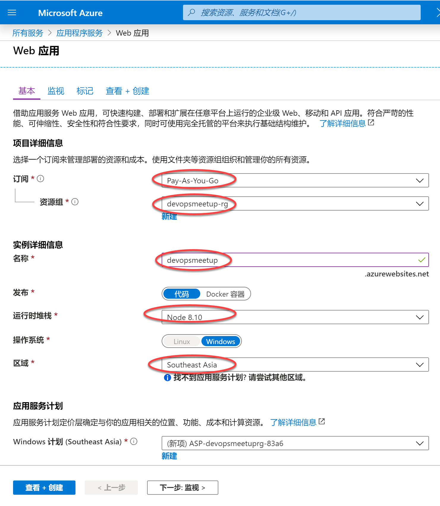

参加参数并点击 **查看 + 创建**，在后续页面中点击 **创建**

## 任务 2 - 创建Azure Pipeline自动化部署CD并完成部署

回到练习3中所完成的构建页面上，并点击右上角的 **Release**按钮

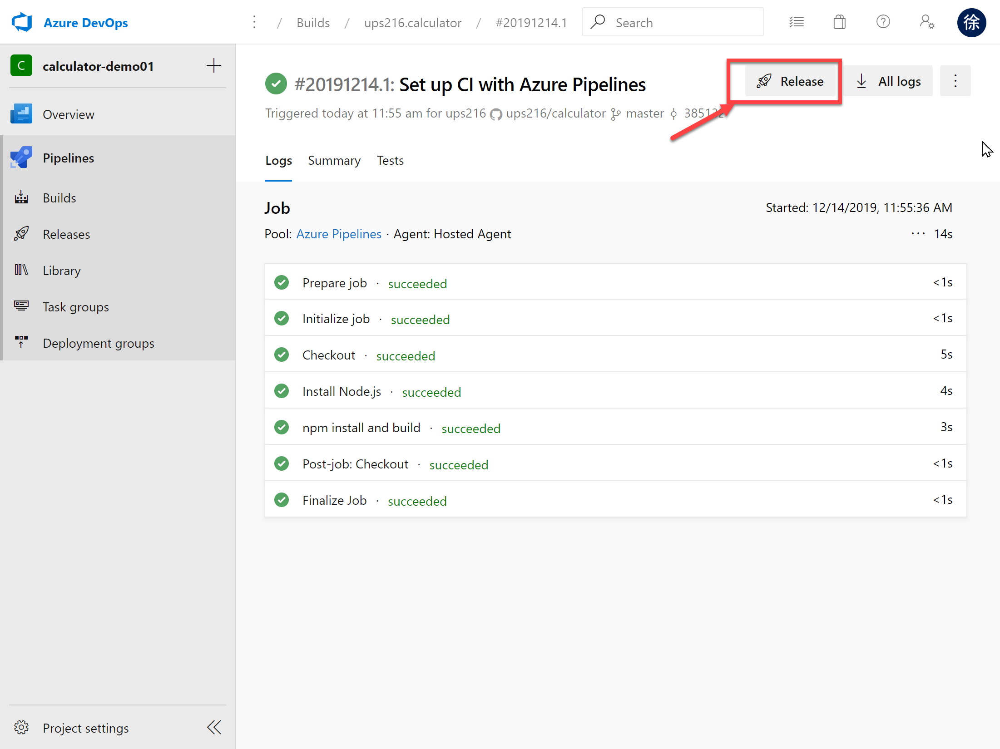

Azure DevOps将检测到你的项目中还没有自动化部署CD配置，会帮助你自动创建一个。请在以下页面中选择 **Azure App Service Deployment** 并点击 **Apply**

**注意**：Azure App Service即为应用程序服务。

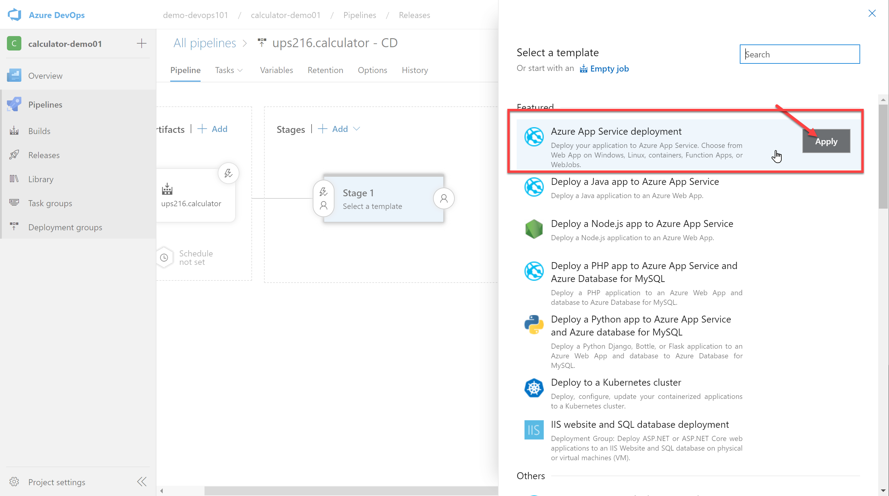

在以下界面中点击带有红色警告标识的链接

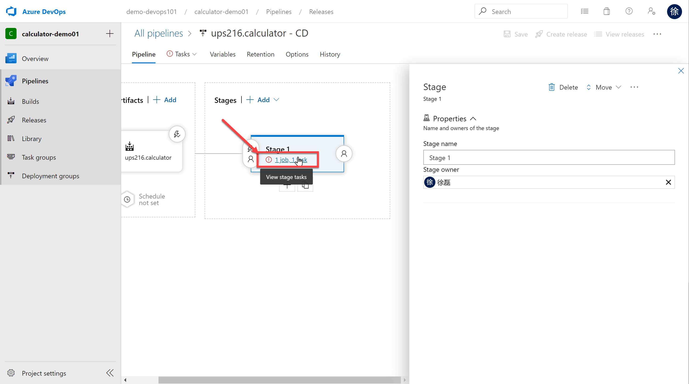

在 Azure Subscrition 参数中选择你自己的订阅，并点击 **Authorize** 完成授权

**注意**：你需要在Azure DevOps和Azure中使用同样一个微软账号才能完成如下的自动授权操作。

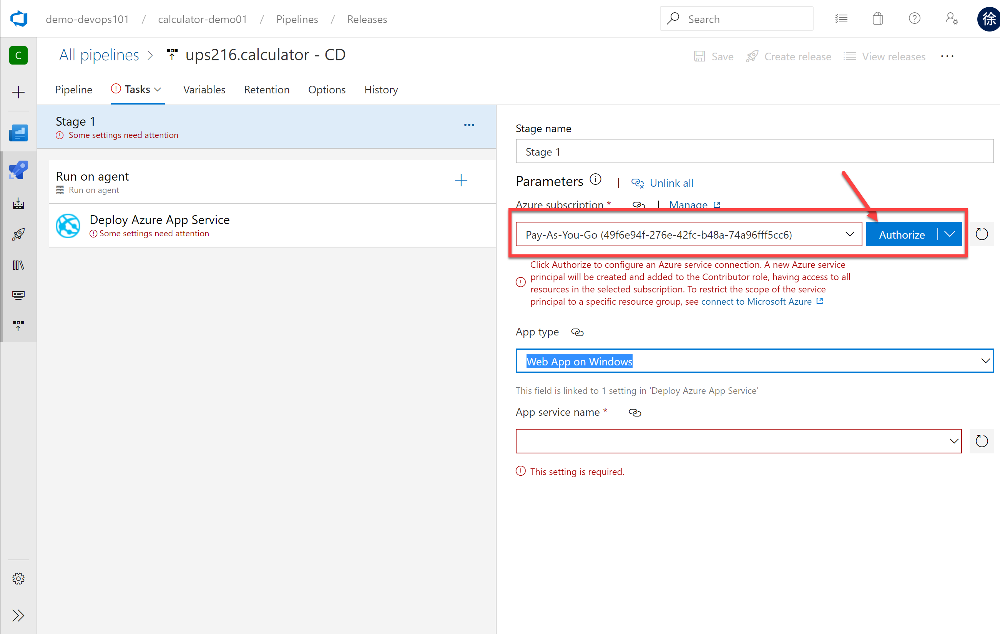

授权通过后，我们即可在 App service name 参数中选择我们刚才在Azure中创建的 **应用程序服务** 实例名称。

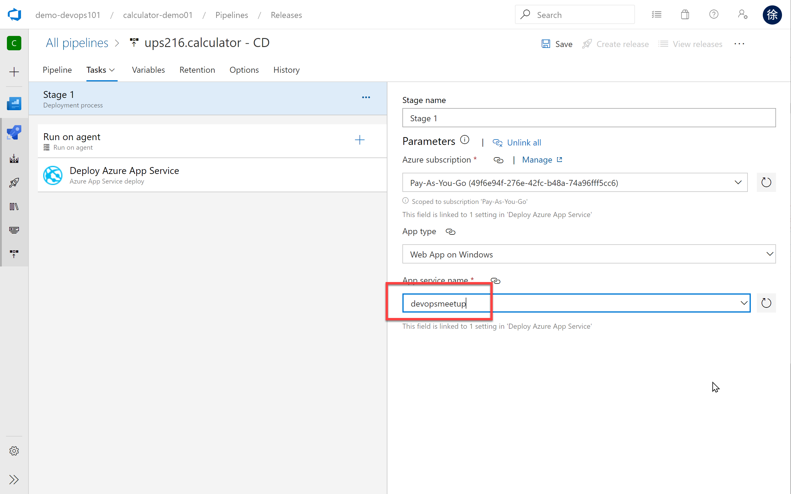

配置参数完成后，在页面右上角点击 **Save**

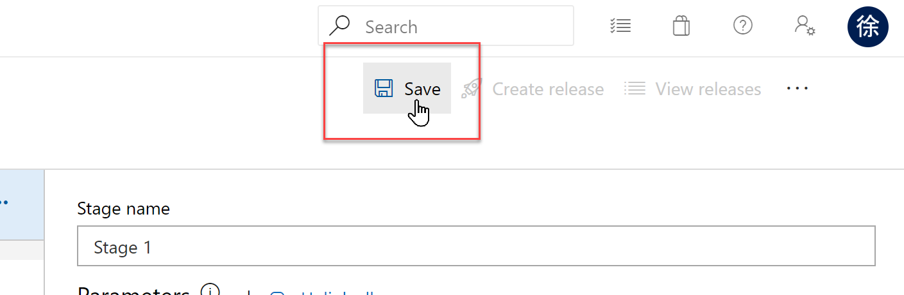

点击 **Create release** 按钮

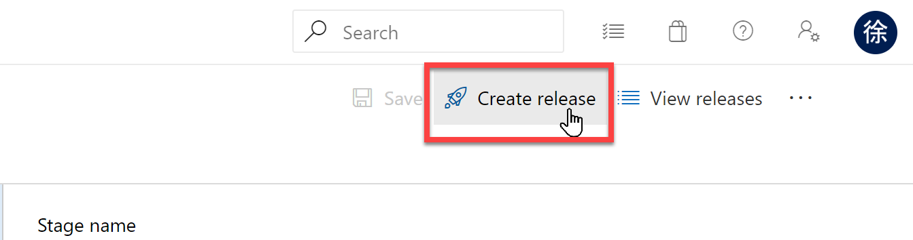

在弹出的对话框中，点击 **Create** 按钮

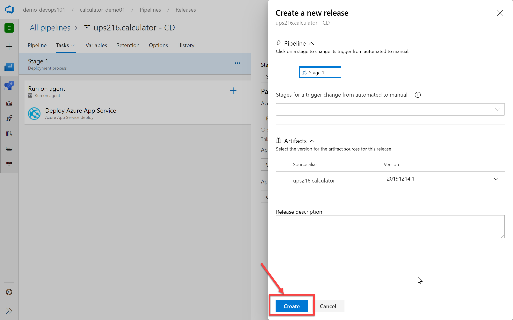

部署启动后，点击页面左上部出现的 **release 1**链接，进入发布状态页面

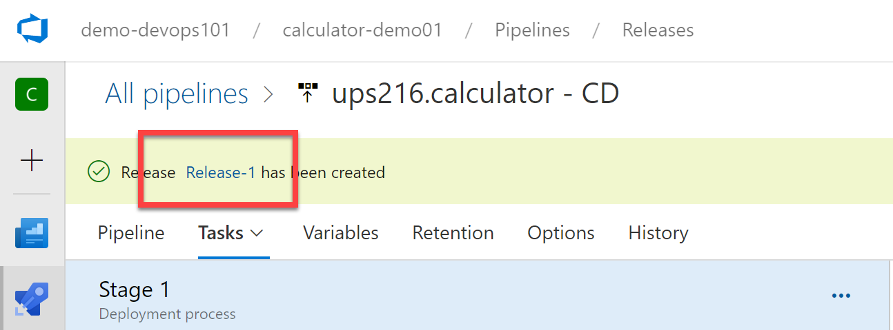

监控部署进展，直到部署完成

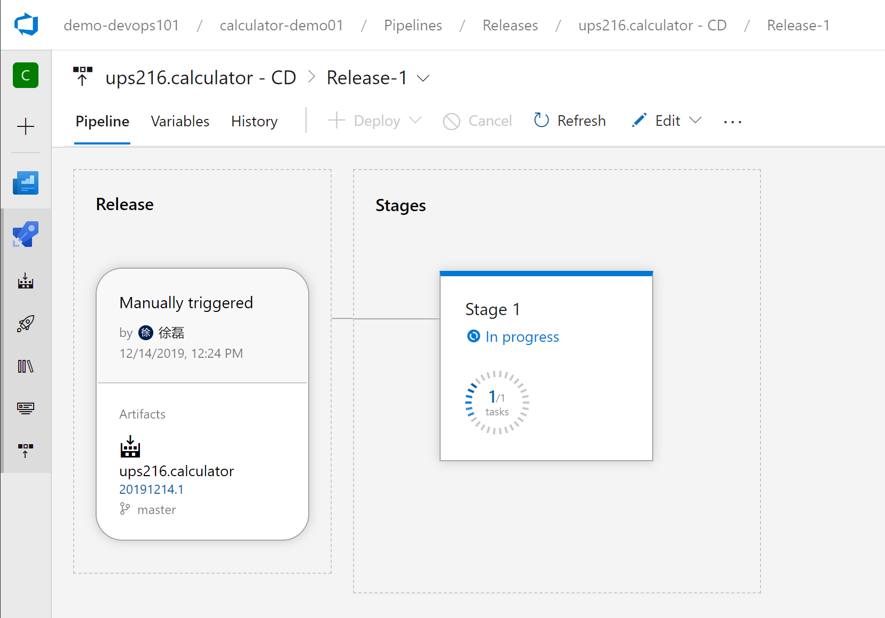

